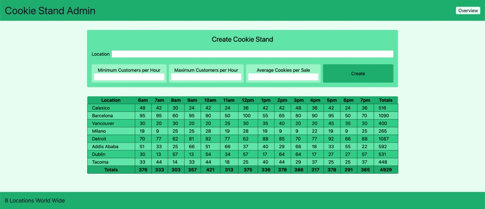

# Cookie Stand Tycoon

What good is being a Cookie Stand Tycoon if you've got no style?

## Overview

The previous web designer's side hussle just got bought out and they've decided to moved on before completing project.

The dreams of a well designed cookie stand administration site are crumbling!

The current site is functional but completely unstyled.

Do you think you have what it takes to get something serviceable whipped up this afternoon?

## Feature Tasks

The requirements are pretty loose. It just needs to look awesome, or at least pretty ok.

Here's a general idea, but please add as much pizzazz as you see fit.

## Design Resources

- [MongoDB Design](https://www.mongodb.design/)
- [Material UI](https://next.material-ui.com/)
- [Ant Design](https://ant.design/)
- [Semantic UI](https://react.semantic-ui.com/)
- [Tailwind CSS](https://tailwindcss.com/)
- [React UI Component Libraries](https://www.codeinwp.com/blog/react-ui-component-libraries-frameworks/)

## Stretch

Add another page and add routing so user can navigate to it from home page.

- [React Router](https://github.com/remix-run/react-router)
- Deploy the site

## Configuration

- Copy the `cookie-stand-admin` folder from lab folder in course repository.
  - Within the new, copied `cookie-stand-admin` folder run `git init` from terminal.
  - In Github create a new **empty** repository named `cookie-stand-admin` then follow the steps to link with your existing local git repository.

_Your repository must include the following config files:_

- `README.md` - with an overview of the project for a new visitor to your repo
- `.gitignore` - with standard NodeJS configurations (see the provided `.gitignore` file)
- `.eslintrc.json` - with Code 301 course standards for the linter (see the provided file in the *configs* folder of the class repo)

## Submission Instructions

1. Complete your Feature Tasks for the lab
1. Create a PR back to the `main` branch of your repository, and merge it cleanly.
1. Ensure your application's latest changes have successfully deployed to Netlify.
1. On Canvas, submit a link to your PR. Add a comment in your Canvas assignment which includes the following:
    - A link to the deployed version of your latest code.
    - A question within the context of today's lab assignment
    - An observation about the lab assignment, or related 'Ah-hah!' moment
    - How long you spent working on this assignment
  